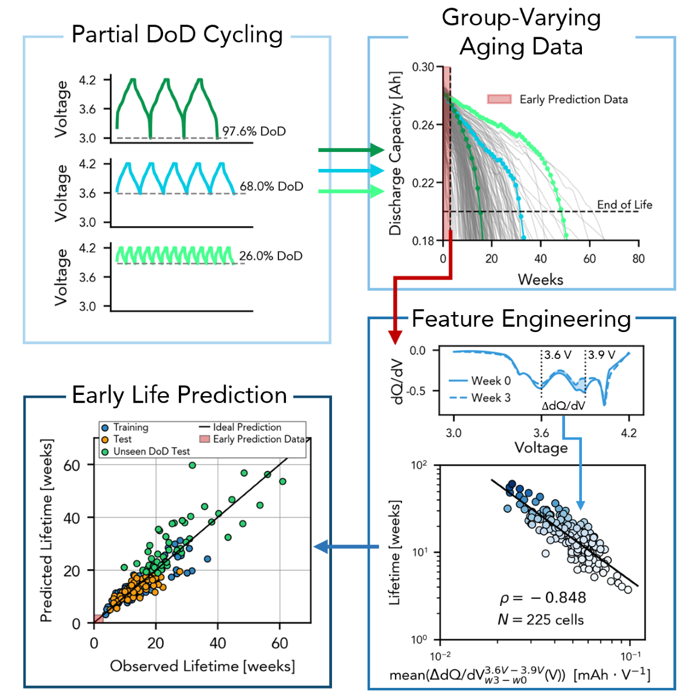

# Early prediction of battery lifetime
This is the code repository for the paper "Predicting Battery Lifetime Under Varying Usage Conditions from Early Aging Data" by Li, Zhou, et al., submitted to Cell Reports Physical Science. 

This repository contains codes for feature extraction and machine learning that generated results in this paper. 

The dataset used in this paper is the ISU-ILCC Battery Aging Dataset, available for download at https://doi.org/10.25380/iastate.22582234. A sample code for pre-processing the data is included in the data repository.

There are three main folders in this repository:
1. "feature_extraction": This folder contains code for extracting early-life features and saved files of train/test data.
2. "elastic_net_models": This folder contains code for training elastic net models with different subsets of features.
3. "hbm_related_codes": This folder contains code for training hierarchical Bayesian models with different subsets of features.

